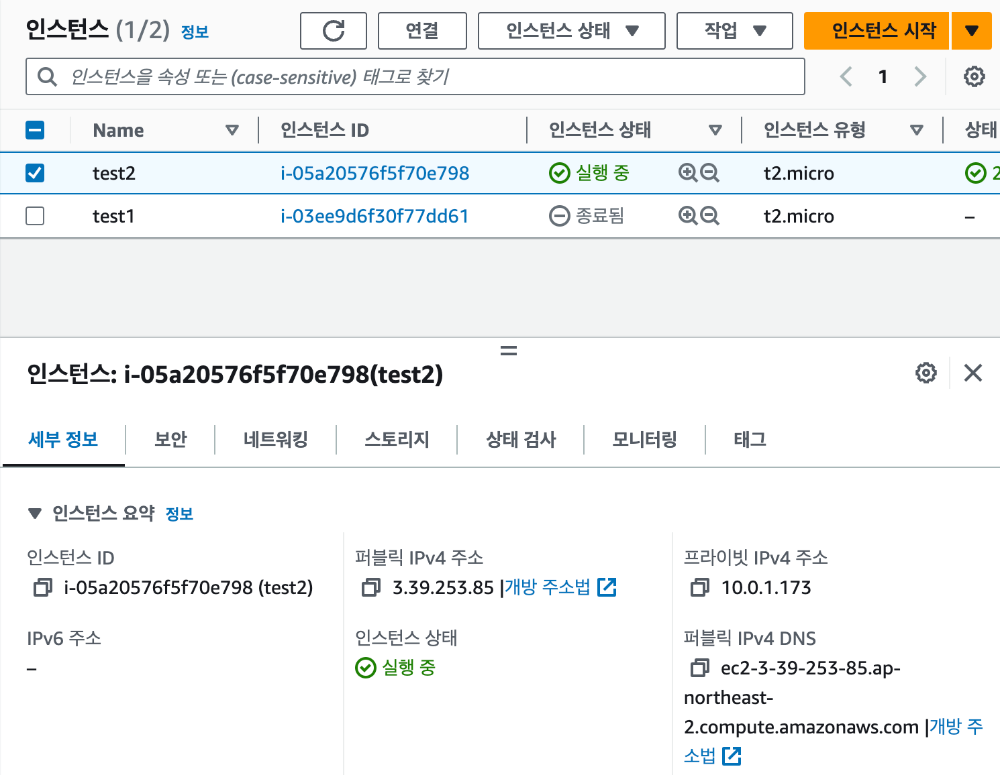
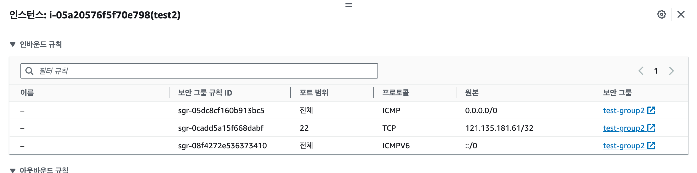
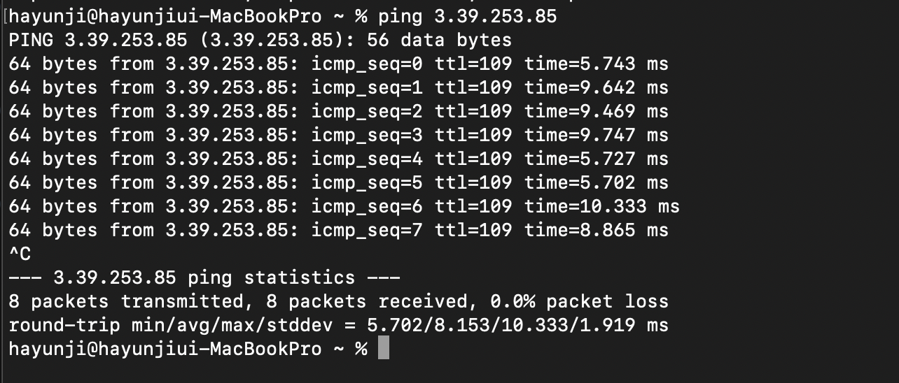

## 과제 인증 사진
1. 인스턴스 생성

2. 인바운드 규칙 수정

3. ping 테스트

## 과제 해결 과정
1. 인터넷 게이트웨이 생성
    
   인터넷 게이트웨이: VPC와 인터넷 간의 통신을 제공하는 관리형 서비스
   인터넷 게이트웨이와 VPC를 연결하면 인터넷을 통해 VPC 내부의 리소스에 대한 외부 엑세스를 가능하게 함  
2. 라우팅 테이블 생성 후 인터넷 게이트웨이로 가는 경로를 넣어줌

## 참고
1. 인터넷 게이트웨이 생성과 VPC 연결 방법
https://choideu.tistory.com/475
2. 인바운드 규칙에서 ICMP 패킷을 추가
https://m.blog.naver.com/nms200299/222046714605