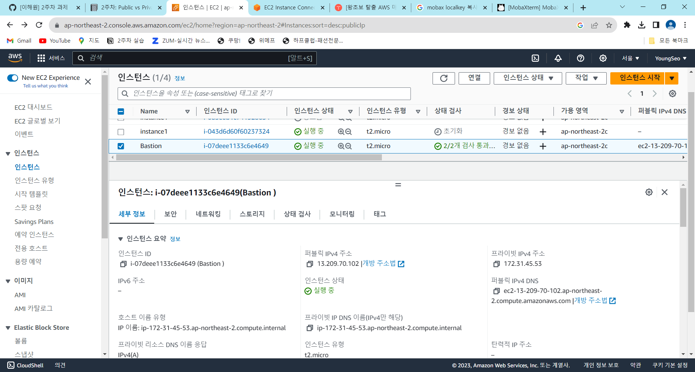

###인증 사진

1.Bastion IP주소

2.instance1 IP주소

3.Bastion SSH 연결 

4.Bastion에서 pem key를 통해 instance1의 private IP로 SSH 연결 성공 

###과제를 해결한 방법

1.Bastion Host생성 후 SSH 연결

2.instance1은 퍼블릭IP가 있으면 안되므로 퍼블릭 IP를 자동할당을 "비활성화"로 선택한 후 생성 

3.mobaXterm에 Bastion의 퍼블릭 ip, username ,pem key입력 후 SSH에 연결

4.home파일 밑에 local에 있는 key파일 복사 

5.sudo chmod 600 으로 내가 key파일을 사용할 수 있도록 권한을 줌

6.ssh -i [Key name].pem user_name@[instance1 private ip]
-> Bastion에서 pem키를 통해 instance1의 private IP로 SSH연결
