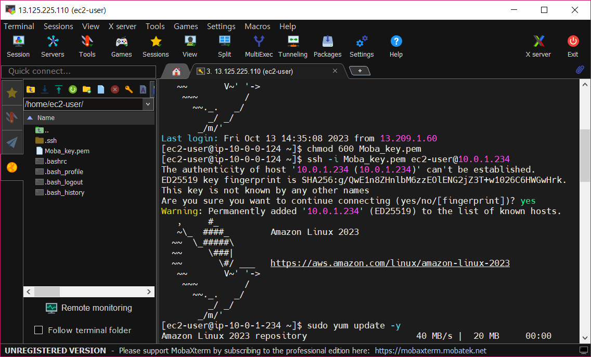
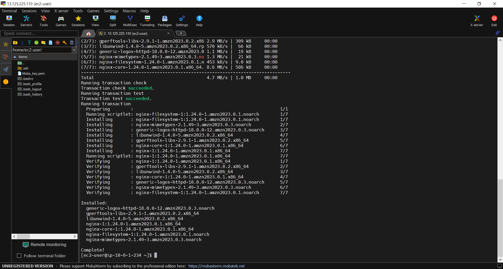

###인증 사진

1.Bastion을 통해서 Private IP를 가진 EC2애 SSH 연결

2.nginx 설치 

3.HTTP 웹페이지 영상
[Web link](https://drive.google.com/file/d/1PNJNKNafx8-ueO8sSb9dCqRkRn_RzLbS/view?usp=sharing)

###과제를 해결한 방법

1.Bastion Host로 Private IP를 가진 EC2 2개(가용영역이 다름) 각각 접근 후 SSH 연결
 -> ssh -i [Key name].pem user_name@[instance1 private ip]

 *EC2 인바운드 규칙편집: HTTP 프로토콜 허용 

2.nginx 설치 
->sudo yum update -y
->sudo yum install nginx
->sudo systemctl start nginx
->sudo systemctl enable nginx
->sudo systemctl status nginx

3.nginx에 정적 파일 설정
->sudo nano /usr/share/nginx/html/index.html 
위 명령어를 이용해 정적파일 교체 

4.ALB 생성 

5.Nat Gateway 생성, 탄력적 IP할당

6.Private 라우팅 테이블에서 0.0.0.0/0트래픽울 Nat을 향하도록 연결 = private 서브넷과 NAT연결 

7.ALB의 DNS를 통해서 Web EC2 접근 

