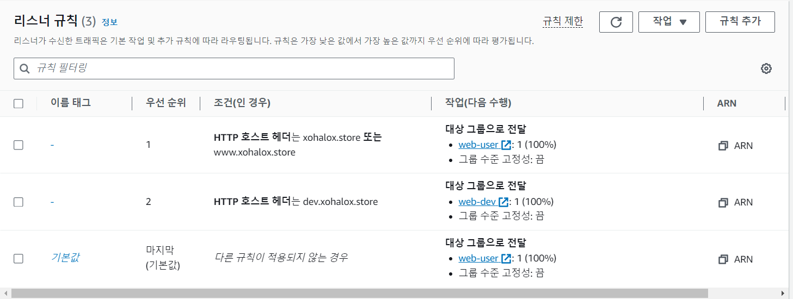
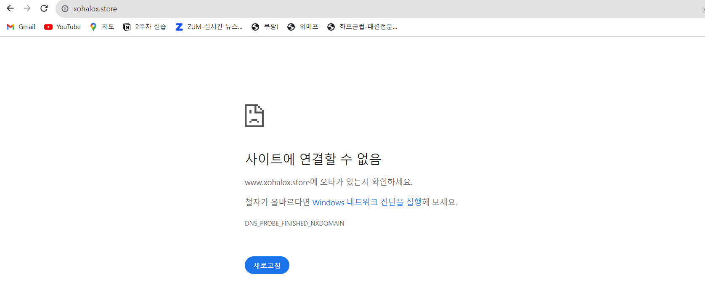

###인증 사진

1.Bastion을 통해서 Private IP를 가진 EC2애 SSH 연결

2.nginx 설치 

3.HTTP 웹페이지 영상
[Web link]()

###과제를 해결한 방법

1.서로 다른 가용영역에 있는 퍼블릭 서브넷 2개를 생성한다.(퍼블릭 서브넷은 라우팅 테이블에 연결되어 있어야한다)
2.dev EC2와 user EC2를 생성한다
3.대상 그룹을 생성하여 EC2를 등록한다.
 -dev는 web-dev대상 그룹에
 -user은 web-user대상그룹에
4.dev와 user를 EC2에 연결하고 NGINX를 설치한다.
 sudo yum update -y # 업데이트 실시
 sudo yum install nginx # yum을 이용한 Apache 설치
 sudo systemctl start nginx # nginx 시작
 sudo systemctl enable nginx # nginx 웹 서버가 시스템이 부팅할 때마다 시작되도록 함
 sudo systemctl status nginx # 상태 확인
5.가비아에서 도메인 구매 후 퍼블릭 호스팅 영역을 생성한다.
 -AWS Route53에서 할당받은 네임서버를 가비아>구입도메인>관리 탭에 넣어준다.
6.ALB와 Route53이 연결되도록 레코드를 생성한다.
 -루트도메인에 대해 A레코드 생성 
 -서브도메인(www,dev)에 대해 A레코드 생성 
7.alb 리스너 규칙 추가
 -루트도메인(xohalox.com)과 서브도메인(www.xohlox.com)은 web-user대상그룹으로 
 -서브도메인(dev.xohalox.com)은 wev-dev대상 그룹으로
8.dev EC2와 userEC2의 /usr/share/nginx/html/index.html파일을 수정한다
 -sudo nano /usr/share/nginx/html/index.html 명령어 이용